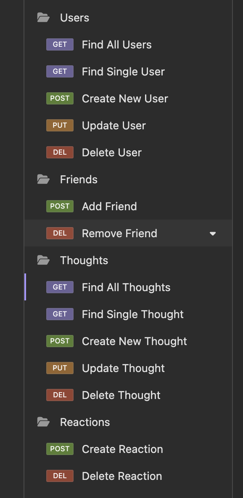

# code-social

## Description

This project produced a backend to a social media website that allows users to be created, found, updated and deleted, user freinds to be added and removed, user's thoughts to be created, read, updated and deleted, and reactions to those thoughts to be created and deleted.
The motivation behind this app was to produce a product would serve as a social media backend.
By completing this project I was able to demonstrate noSQL and mongoDB principals I learned in bootcamp coding class.

## Table of Contents

- [Installation](#Installation)
- [Useage](#Useage)
- [Credits](#Credits)
- [License](#License)
- [Tests](#Tests)
- [Questions](#Questions)

## Installation

Run the following commands in your integrated terminal to start the server.
"node server.js"

Open insomnia and start making API calls based on the desired function

## Useage

Useage is strictly limited to backend production. Use insomnia or a similar API tool to perform the desired functions.

## Credits

Thank you to my bootcamp instructors, Roger and Sasha for the instruction that allowed me to build my app.

## License

MIT License

## Tests

https://watch.screencastify.com/v/yE0wqrbbjWvYaf16ClYk

## Questions

https://github.com/coulterkyle

For questions regarding this app, contact me at:

e-mail: kcoulter2002@gmail.com